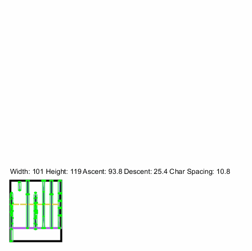

<h3 align="center"> 🚧 This README (and library) is under construction 🚧 </h3>

# PText

**PText** bridges the gap between Processing's PFont and PShape classes, providing some much needed functionality when working with text in Processing.

PText extends `PShape`, meaning that is stores text in a vector format. With this, it offers methods to:

* Easily manipulate text dimensions
* Get a text's exact bounds (dimensions)
* Accurately get text's ascent and descent (unlike Processing's existing methods — see [appendix](#Appendix))
* Visualise per-character bounds, whitespace, and vertices

# API

The PText API is catalogued below.

## Text

* **`setText(text)`**
* **`setFont(fontNameString, fontSize)`**
* **`setFont(PFont)`**

## Dimensions

* **`scale(both)`**
* **`scale(x, y)`**
* **`setScale(both)`**
* **`setScale(x, y)`**

### Width

* **`setTextWidth(n)`**
<p align="center">
  <a href="https://github.com/micycle1/">
  </a>
</p>

* **`scaleWidth(n)`**
* **`getTextWidth()`**


### Height

* **`setTextHeight(n)`**
<p align="center">
  <a href="https://github.com/micycle1/">
  </a>
</p>

* **`scaleHeight(n)`**
* **`getTextHeight()`**

## Text Attributes

* **`setCharacterSpacing(n)`**
<p align="center">
  <a href="https://github.com/micycle1/">
  </a>
</p>

* **`getTextAscent()`**
* **`getTextDescent()`**
* **`getFontAscent()`**
* **`getFontDescent()`**
* **`getWhiteSpaceLeft()`**
* **`getWhiteSpaceRight()`**
* **`getCharWidth(character)`**
* **`getCharHeight(character)`**
* **`getCharWhitespace(character)`**

## Debug

* **`debug()`**
<p align="center">
  <a href="https://github.com/micycle1/">
  </a>
</p>

# Example

Resizing a PText shape using setTextWidth() and setTextHeight(), using debug() to show 

```
import pText.PText;

PText text;

void setup() {
  
  size(1280, 720);
  smooth(4);

  text = new PText(this, "Bauhaus 93", 192);
  
  text.setText("hello");
  
  text.setFill(color(55, 255, 90));
  text.setStrokeWeight(1);

  text.setScale(1, 1);
  //shapeMode(CENTER);
  text.setTextWidth(width);
  text.setTextHeight(height);
  
    noFill(); // you must call global noFill() after any setText(), otherwise text can't be filled
}

void draw() {

  background(255);

  shape(text, mouseX, mouseY);
  //text.debug(mouseX, mouseY);
}
```

# Appendix

Using the inbuilt functions `textWidth()`, `textAscent()`, and `textDescent()` are an easy way to get a *good* approximate result for the height and width of a string (of a given font), but they are not *exact*.

Why? 

- `textAscent()` returns text height above the baseline **based on the letter 'd'**
- `textDescent()` returns text height below the baseline **based on the letter 'p'**.
- `textWidth()` includes glyph whitespace (aka padding; ideally we want to ignore this for the first and last characters)

`textAscent() + textDescent()` therefore measures the **maximum height** of a string in a given font and font size, and not the height of a specific string. In other words, if your text doesn't include both 'd' and 'p' characters, then using these methods to determine text height will overestimate the result.

# TODO

- [x] Scale whitespace (to increase/decrease spacing between letters, independent of font size)
- [x] Display dimension labels (such as ascent & descent) in debug mode
- [x] String ascent: return the max ascent of the string's **current** characters
- [x] String descent: return the max descent of the string's **current** characters
- [ ] Allow multiple fonts within one PText at once?
- [ ] Support multiple lines / blocks of text